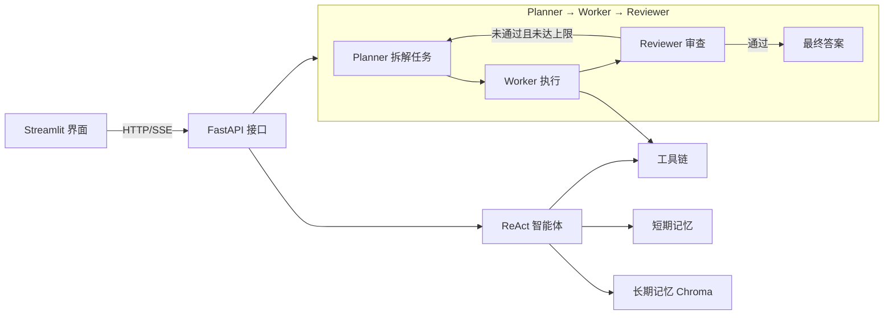

# AgentForge ⚒️

基于 **LangChain + LangGraph** 的多智能体协作框架，集成 **ReAct 推理模式** 与 **Planner → Worker → Reviewer 工作流**，支持工具调用、短期/长期记忆、多用户系统、HTTP API 与 Web 界面。

> 一个适合作为面试项目展示的多智能体实践：从单 Agent 推理，到多 Agent 协作编排，再到工具链、记忆、API 与前端，形成完整闭环。

## ✨ 功能特性

- **ReAct 智能体** — Thought → Action → Observation → Final Answer 推理循环，支持流式输出
- **多智能体协作** — Planner 拆解任务 → Worker 执行 → Reviewer 审查，支持迭代优化
- **9 个核心工具** — 搜索、计算器、代码解释器、文件读写、目录列举、网页抓取、API 调用、图片生成
- **记忆系统** — 短期记忆（对话历史）+ 长期记忆（Chroma 向量库，内置离线哈希嵌入）
- **用户系统** — 多用户支持、对话持久化、历史导出
- **HTTP API** — FastAPI + Uvicorn，含 SSE 流式接口
- **Web 界面** — Streamlit，支持对话与工作流两种模式
- **测试完备** — 38 个单元测试，外部 LLM 依赖全部 mock，离线可跑

## 🧠 架构



## 🛠 技术栈

| 组件 | 技术 |
|------|------|
| 智能体框架 | LangChain, LangGraph |
| LLM | 智谱 GLM-4（zhipuai） |
| Web 框架 | FastAPI + Uvicorn |
| 前端界面 | Streamlit |
| 向量数据库 | ChromaDB |
| 图片生成 | 智谱 CogView |
| 配置管理 | python-dotenv |
| 测试 | pytest |

## 📁 项目结构

```text
AgentForge/
├── agentforge/                 # 主包
│   ├── agents/                 # 智能体（base/react/planner/worker/reviewer）
│   ├── tools/                  # 工具链
│   ├── memory/                 # 短期 + 长期记忆
│   ├── graph/                  # LangGraph 工作流编排
│   ├── user/                   # 用户系统与对话存储
│   ├── api/                    # FastAPI 路由
│   ├── ui/                     # Streamlit 界面
│   └── __init__.py
├── config/                     # 配置与日志
├── tests/                      # 单元测试（38 个）
├── docs/                       # 架构文档
├── Dockerfile
├── docker-compose.yml
├── pyproject.toml
├── requirements.txt
└── .env.example                # 环境变量模板
```

## 🚀 快速开始

### 1. 环境要求

- Python 3.10+

### 2. 克隆与安装

```bash
git clone https://github.com/konoLioda/agentforge.git
cd agentforge

python -m venv venv
# Windows
venv\Scripts\activate
# Linux / macOS
source venv/bin/activate

pip install -r requirements.txt
```

### 3. 配置环境变量

复制 `.env.example` 为 `.env`，填入你的 API 密钥（`.env` 已被 gitignore，切勿提交真实密钥）：

```bash
cp .env.example .env
```

### 4. 启动 Streamlit 界面

```bash
streamlit run agentforge/ui/streamlit_app.py
```

浏览器打开 http://localhost:8501

### 5. 启动 FastAPI 服务

```bash
python -m uvicorn agentforge.api.routes:app --host 0.0.0.0 --port 8000
```

API 文档见 http://localhost:8000/docs

### 6. 使用 Docker 一键启动

```bash
docker compose up --build
```

- API: http://localhost:8000
- UI: http://localhost:8501

## 🔌 API 概览

| 方法 | 路径 | 说明 |
|------|------|------|
| POST | `/chat` | 单轮对话 |
| POST | `/chat/stream` | 流式对话（SSE） |
| POST | `/workflow` | 多智能体工作流 |
| POST | `/users/create` | 创建用户 |
| GET | `/users/list` | 用户列表 |
| GET | `/users/{id}/conversations` | 对话历史 |
| GET | `/health` | 健康检查 |

## 🧪 运行测试

```bash
pip install pytest pytest-cov
pytest -v
```

测试通过 mock `zhipuai.ZhipuAI`，无需真实 API Key、无需联网即可全绿通过。

## 📚 更多文档

- [架构设计](docs/architecture.md)
- [面试准备](docs/interview-qa.md)

## 📄 许可证

[MIT License](LICENSE) © Lio (konoLioda)
