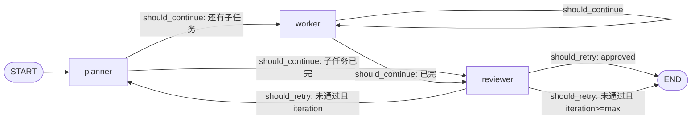
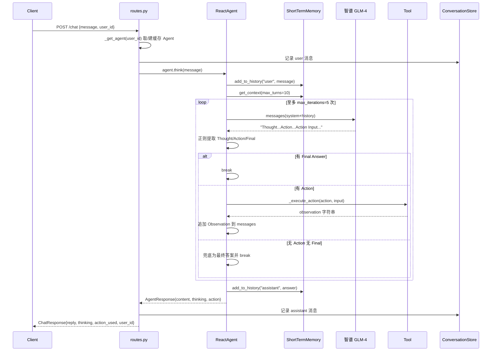
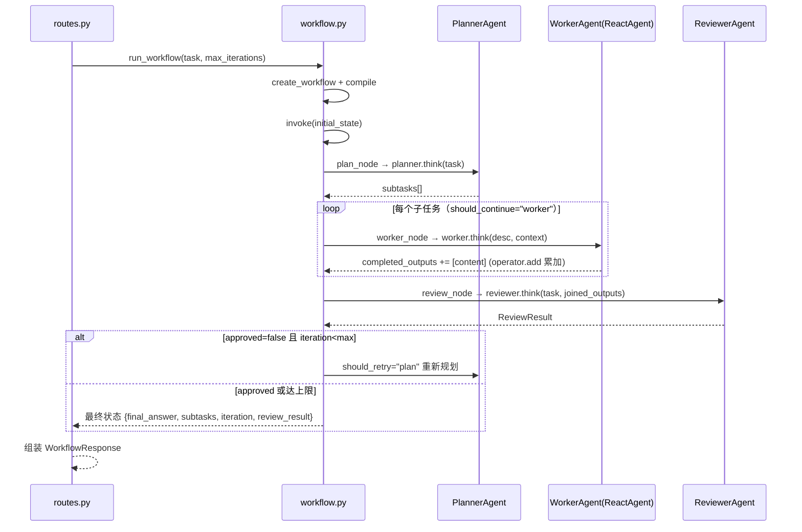

# AgentForge 架构设计文档

> 作者：Lio（GitHub: konoLioda）
> 版本：1.0.0
> 技术栈：LangChain + LangGraph · 智谱 GLM-4 · FastAPI · Streamlit · ChromaDB · Pydantic v2

---

## 1. 项目定位与设计目标

AgentForge 是一个**基于 LangChain + LangGraph 的多智能体协作框架**，它把「单智能体推理」到「多智能体协作」的完整链路打包成一个可运行、可测试、可演示的闭环，核心定位是：

- **教学与展示型项目**：用最小的代码体量讲清楚「LLM Agent 是怎么运转的」——从一条 prompt 到一个工具调用，从一次 ReAct 循环到一张 LangGraph 状态图。
- **双范式并置**：同时提供 `ReAct`（单 Agent 推理 + 工具）与 `Planner → Worker → Reviewer`（多 Agent 编排）两条路径，便于横向对比两种 Agent 架构。
- **工程完整性**：不止有 Agent，还补齐了记忆、工具、用户、HTTP API、Web UI、日志、配置、测试，形成「可面试、可扩展」的骨架。
- **开箱即用、离线可测**：外部 LLM 依赖全部可注入/mock，测试无需真实 API Key 与网络即可全绿。

设计上遵循三条原则：

1. **最小依赖直觉**：能自己用正则/标准库实现的（如 ReAct 解析、安全计算、哈希嵌入），不引入重量级组件。
2. **依赖可注入**：LLM 客户端、API Key、记忆、嵌入函数均通过构造参数注入，便于测试与替换。
3. **失败可降级**：解析失败、审查失败、工具失败都有默认兜底，绝不因一个子步骤异常而拖垮整体。

---

## 2. 总体架构

项目采用经典的分层结构，主包为 `agentforge/`（已从 `src/` 重命名），配置在 `config/`，测试在 `tests/`。

```text
AgentForge/
├── agentforge/                 # 主包
│   ├── agents/                 # 智能体层：base / react / planner / worker / reviewer
│   ├── graph/                  # 编排层：LangGraph 状态机
│   ├── tools/                  # 工具层：9 个注册工具（+ extract_zip 未注册）
│   ├── memory/                 # 记忆层：短期(deque) + 长期(Chroma)
│   ├── user/                   # 用户层：JSON 持久化 + 对话存储
│   ├── api/                    # 接口层：FastAPI + SSE
│   └── ui/                     # 展示层：Streamlit
├── config/                     # 配置与日志（settings.py / logging_config.py）
├── tests/                      # 单元测试（38 个）
├── pyproject.toml              # 打包与测试配置
└── requirements.txt
```

### 2.1 分层架构图

```mermaid
flowchart TB
    subgraph UI["展示层 agentforge/ui"]
        Streamlit["streamlit_app.py<br/>登录 / ReAct 对话 / 工作流"]
    end

    subgraph API["接口层 agentforge/api"]
        FastAPI["routes.py<br/>/chat · /chat/stream(SSE) · /workflow · /users/*"]
    end

    subgraph Graph["编排层 agentforge/graph"]
        LangGraph["workflow.py<br/>Planner → Worker → Reviewer 状态机"]
    end

    subgraph Agents["智能体层 agentforge/agents"]
        Base["BaseAgent(ABC)<br/>AgentResponse(Pydantic)"]
        React["ReactAgent<br/>Thought/Action/Observation"]
        Planner["PlannerAgent<br/>任务拆解(JSON)"]
        Worker["WorkerAgent<br/>内嵌 ReactAgent 执行"]
        Reviewer["ReviewerAgent<br/>质量审查(JSON)"]
    end

    subgraph Memory["记忆层 agentforge/memory"]
        STM["ShortTermMemory<br/>deque(maxlen=20)"]
        LTM["LongTermMemory<br/>Chroma + SimpleEmbedding"]
    end

    subgraph Tools["工具层 agentforge/tools"]
        T["web_search · calculator · code_interpreter<br/>read/write/list_file · web_scraper · call_api · image_gen"]
    end

    subgraph User["用户层 agentforge/user"]
        UM["UserManager<br/>data/users.json"]
        CS["ConversationStore<br/>data/users/{id}/conversations.json"]
    end

    subgraph Config["配置层 config"]
        Settings["settings.py(.env) · logging_config.py"]
    end

    Streamlit -->|HTTP/SSE| FastAPI
    FastAPI --> React
    FastAPI --> LangGraph
    LangGraph --> Planner
    LangGraph --> Worker
    LangGraph --> Reviewer
    Worker --> React
    React --> T
    React --> STM
    React -.->|recall(默认关闭)| LTM
    FastAPI --> UM
    FastAPI --> CS
    Streamlit --> UM
    Streamlit --> CS
    Agents --> Config
    Memory --> Config
```

> 虚线 `React -.-> LTM` 表示长期记忆的**检索能力已实现但默认未启用**（见 §3.3）。

### 2.2 技术选型一览

| 组件 | 技术 | 用途 |
|------|------|------|
| 智能体框架 | LangChain（`Tool`）、LangGraph（`StateGraph`） | 工具封装 / 状态机编排 |
| LLM | 智谱 GLM-4（`zhipuai`，`glm-4`） | 推理与生成 |
| 向量库 | ChromaDB（`PersistentClient`） | 长期记忆持久化与检索 |
| Web | FastAPI + Uvicorn | REST + SSE 流式 |
| 前端 | Streamlit | 对话 / 工作流双模式 |
| 校验 | Pydantic v2（`BaseModel`） | 请求/响应/Agent 输出结构约束 |
| 配置 | python-dotenv | `.env` 环境变量 |
| 测试 | pytest + pytest-cov | 38 个单元测试 |

---

## 3. 各模块职责与关键设计决策

### 3.1 智能体层（`agentforge/agents/`）

#### 3.1.1 BaseAgent 与 AgentResponse

- `AgentResponse`（`base_agent.py`）用 Pydantic 定义智能体的标准输出契约：

  ```python
  content: str            # 回复内容
  thinking: Optional[str] # 思考过程
  action: Optional[str]   # 最后执行的动作名
  action_input: Optional[str]
  need_memory: bool = False  # 是否需要存入长期记忆（预留钩子）
  ```

- `BaseAgent(ABC)` 提供通用骨架：`name`、`model`（默认 `settings.ZHIPU_MODEL`）、`short_term`（默认实例化 `ShortTermMemory()`）、`long_term`（**默认为 `None`**）。
- 抽象方法 `think()` 强制子类实现；同时提供 `remember()` / `recall()` / `get_context()` / `add_to_history()` / `clear_memory()` 等记忆操作。

**关键设计决策**：把「可复用的记忆与上下文管理」上提到基类，让每个 Agent 子类只关注「如何把输入变成输出」；`long_term` 默认为 `None` 是一个**惰性/可选设计**——只有显式注入 `LongTermMemory` 时，`recall()` 才会真正检索，`remember()` 才会真正落库。

#### 3.1.2 ReactAgent：ReAct 循环的解析与执行

ReAct 的核心是让 LLM 在**同一次对话中交替输出推理（Thought）与动作（Action）**，由外部执行器把动作结果作为 Observation 回填，直到输出 Final Answer。本项目**没有使用 LangChain 的 `AgentExecutor`**，而是手写循环，因此对每一环都有完全控制权。

**（1）工具注册表**（`react_agent.py` 顶部）：

```python
AVAILABLE_TOOLS = {
    "web_search": search_tool,
    "calculator": calculator_tool,
    "code_interpreter": code_interpreter_tool,
    "read_file": read_file_tool,
    "write_file": write_file_tool,
    "list_files": list_files_tool,
    "web_scraper": web_scraper_tool,
    "call_api": api_call_tool,
    "image_gen": image_gen_tool,
}
```

共 **9 个工具**（`file_tool.py` 里另有一个 `extract_zip_tool` 被 `__init__.py` 导出，但**未注册进** `AVAILABLE_TOOLS`，因此 ReAct 用不到）。工具描述通过 `_build_tool_descriptions()` 拼成文本注入系统提示词。

**（2）系统提示词**（`REACT_SYSTEM_PROMPT`）强制约束输出格式：

```text
Thought: 描述你的思考过程
Action: 工具名称
Action Input: 工具的输入参数

Observation: 工具返回的结果（由系统自动填充）
...
Final Answer: 你的最终回答
```

并规定「每次只能一个 Action」「工具名必须完全匹配列表」「用中文思考回答」。

**（3）主循环 `think()`** 的执行顺序：

1. 用户输入写入短期记忆（`add_to_history("user", ...)`）。
2. 调用 `recall(user_input, n_results=3)` 尝试检索长期记忆（默认 `long_term=None` 时为 no-op）。
3. 组装消息：`[system(系统提示词 + 记忆上下文)] + 最近 10 轮对话`。
4. 进入 `for iteration in range(self.max_iterations)`（默认 `max_iterations=5`）循环：
   - 调用 LLM → 用正则解析 Thought / Action / Final Answer；
   - 有 Final Answer 就 `break`；
   - 有 Action + Action Input 就 `_execute_action()`，把结果拼成 `Observation: ...` 追加回消息列表；
   - 两者都没有（模型跑偏）→ 直接把整段响应当最终答案并 `break`，**防止死循环**。
5. 助手回复写回短期记忆，组装 `AgentResponse`（含 `thinking` 步骤链）。

**（4）正则提取（`react_agent.py` 中三个 `_extract_*` 方法）**——这是本项目的核心细节：

| 字段 | 正则 | 说明 |
|------|------|------|
| Thought | `r"Thought:\s*(.+?)(?=Action:\|Final Answer:\|$)"`（`DOTALL`） | 非贪婪，截到 Action/Final Answer/行尾为止 |
| Action | `r"Action:\s*(.+?)\s*$"`（`MULTILINE`） | 按行匹配工具名 |
| Action Input | `r"Action Input:\s*(.+?)\s*$"`（`MULTILINE`） | 按行匹配参数 |
| Final Answer | `r"Final Answer:\s*(.+)"`（`DOTALL`） | 贪婪取到结尾 |

**（5）工具执行 `_execute_action()`** 的安全与容错：

- 先查表：`action_name not in AVAILABLE_TOOLS` → 返回「未知工具 + 可用列表」字符串（而非抛异常）。
- 再解析输入：先尝试 `json.loads(action_input)`；若解析成 `dict` 则 `tool.func(**parsed_input)`（结构化传参），否则 `tool.run(action_input)`（纯文本）；`JSONDecodeError/TypeError` 时回退纯文本。
- 全程 `try/except`：任何工具异常都转为 `"工具执行出错: ..."` 字符串回传给 LLM，保证循环不中断。

**设计权衡**：手写 ReAct 比 `AgentExecutor` 更透明、更可控（解析规则、循环上限、降级策略都自己定），代价是失去了 LangChain 原生工具绑定、记忆注入、结构化输出等便利，且正则解析对模型输出的格式漂移较脆弱。

#### 3.1.3 Planner / Worker / Reviewer

| 智能体 | 文件 | 输入 → 输出 | temperature | 解析 | 降级 |
|--------|------|------------|-------------|------|------|
| `PlannerAgent` | `planner_agent.py` | 任务文本 → `PlannerOutput`（`subtasks` + `total_count`） | **0.3**（规划求确定性） | 强制 JSON，容忍 ```` ```json ```` 代码块 | 解析失败 → 生成单任务 `PlannerOutput` |
| `WorkerAgent` | `worker_agent.py` | 子任务 + 上下文 → `AgentResponse` | 内部复用 ReactAgent（0.7） | — | — |
| `ReviewerAgent` | `reviewer_agent.py` | 任务 + 产出 → `ReviewResult`（`score`/`strengths`/`improvements`/`approved`/`feedback`） | **0.3** | 强制 JSON | 解析失败 → **默认通过**（`score=7, approved=True`） |

三个 Agent 的 `think()` 签名各不相同（`Planner.think(user_input)`、`Worker.think(task, context=None)`、`Reviewer.think(task, output)`），说明它们虽有共同基类，但职责边界清晰、契约独立。

**关键设计决策**：
- **`SubTask` 显式建模依赖**（`id`、`depends_on`、`assigned_to`），为「按依赖顺序执行」预留了数据基础。
- **`WorkerAgent` 内部持有一个 `ReactAgent`（`name="Worker-ReAct"`）**：Worker 自己不直接推理，而是「把带上下文的任务丢给 ReAct 子代理去执行」。这体现了**分层复用**——复杂执行能力下沉到 ReAct，Worker 只负责「任务 + 上下文」的包装。
- **Planner/Reviewer 用低温度 0.3** 求结构化输出的稳定性，ReAct 用 0.7 保留探索性；这是对「不同角色需要不同采样策略」的直接体现。
- **降级策略偏乐观**：Planner 失败降级成「单任务」保证流程能跑；Reviewer 失败默认「通过」保证不卡死。代价是可能放行低质量结果（见 §6 权衡）。

### 3.2 编排层：LangGraph 状态机（`agentforge/graph/workflow.py`）

LangGraph 把「多 Agent 协作」表达为一张有状态图。本项目用它串联 Planner → Worker → Reviewer，并用**条件边**实现循环。

**（1）状态定义 `WorkflowState(TypedDict)`**：

```python
class WorkflowState(TypedDict):
    original_task: str
    subtasks: List[dict]
    current_task_id: int
    completed_outputs: Annotated[List[str], operator.add]   # 关键：累加而非覆盖
    review_result: Optional[dict]
    iteration: int
    max_iterations: int
    final_answer: str
```

**`Annotated[List[str], operator.add]` 是本项目最重要的状态机设计点**：LangGraph 中节点返回的 `dict` 默认是**覆盖**原状态；对 `completed_outputs` 用 `operator.add` 做 reducer 后，每个 Worker 节点返回的 `completed_outputs: [response.content]` 会被**追加（list 拼接）**到已有列表上，而不是替换。这样「多个子任务的输出」才能在多次回到 Worker 节点的过程中被持续收集起来。

**（2）三个节点**：

- `plan_node`：调用 `planner.think(original_task)`，把 `SubTask` 列表 `model_dump()` 成 dict 存入 `subtasks`，`current_task_id` 置 1，`iteration += 1`。
- `worker_node`：按 `current_task_id` 找到当前子任务；遍历 `depends_on` 找到前置任务，用 `idx = t["id"] - 1` 从 `completed` 取对应输出拼成上下文；调用 `worker.think(description, context)`；返回 `completed_outputs=[content]`（靠 `operator.add` 累加）并 `current_task_id += 1`。
- `review_node`：把所有 `completed_outputs` 用 `\n\n` 拼接，调用 `reviewer.think(original_task, final_output)`；通过则 `final_answer` 赋值为拼接结果，否则留空。

**（3）两条条件边（路由函数）**：

```python
def should_continue(state):   # planner / worker 之后
    return "worker" if state["current_task_id"] <= len(subtasks) else "review"

def should_retry(state):      # reviewer 之后
    if review.get("approved"): return "end"
    if state["iteration"] < state["max_iterations"]: return "plan"
    return "end"
```

- `should_continue` 驱动「顺序执行子任务」：`current_task_id <= len(subtasks)` 就继续回 Worker，否则去 Reviewer。
- `should_retry` 驱动「审查重试」：未通过且 `iteration < max_iterations` 就回到 Planner 重新规划（默认 `max_iterations=3`），否则结束。

**（4）图结构**：



对应的建图代码：

```python
graph = StateGraph(WorkflowState)
graph.add_node("planner", plan_node)
graph.add_node("worker", worker_node)
graph.add_node("reviewer", review_node)
graph.set_entry_point("planner")
graph.add_conditional_edges("planner", should_continue, {"worker": "worker", "review": "reviewer"})
graph.add_conditional_edges("worker", should_continue, {"worker": "worker", "review": "reviewer"})
graph.add_conditional_edges("reviewer", should_retry, {"plan": "planner", "end": END})
```

`run_workflow(task, max_iterations=3)` 负责 `create_workflow()` → `compile()` → `invoke(initial_state)`，返回最终状态 dict。

**关键设计决策与一处已知限制**：
- **`depends_on` 的「依赖顺序」其实是靠 `current_task_id` 线性递增 + `idx = id - 1` 直接下标映射实现的**，没有做真正的拓扑排序。这意味着子任务必须按 `id` 顺序执行，`depends_on` 只用来「回读上下文」，而非真正调度并发/乱序依赖。
- 每个 `create_workflow()` 调用都会**新建** Planner/Worker/Reviewer，因此工作流 Agent 的短期记忆不跨请求保留；Worker 内的 ReactAgent 也只在单次工作流内复用。

### 3.3 记忆层（`agentforge/memory/`）

#### 3.3.1 短期记忆 ShortTermMemory

- 用 `collections.deque(maxlen=20)` 保存 `{"role", "content"}` 消息，**固定长度、自动淘汰最旧消息**，天然限制上下文膨胀。
- 提供 `add_message` / `get_messages` / `get_recent(n=5)` / `clear` / `summary`。
- ReactAgent 组装消息时取 `get_context(max_turns=10)`，即最多携带最近 10 轮对话。

**设计决策**：`deque(maxlen)` 比手写 list + 截断更简洁且 O(1) 追加，是「滑动窗口式工作记忆」的惯用实现。

#### 3.3.2 长期记忆 LongTermMemory

- 用 `chromadb.PersistentClient(path=settings.VECTOR_DB_PATH)` 持久化，集合 `agent_memory`，`metadata={"hnsw:space": "cosine"}`（余弦相似度）。
- `add_memory` 用递增 ID `mem_{count:06d}`；`search(query, n_results=5)` 返回 `id/content/metadata/distance`；另有 `get_all/clear/delete_memory`。

**为什么默认用「离线哈希嵌入」而非下载模型？**（`SimpleEmbedding`，维度 64）

`long_term.py` 内置了一个 `SimpleEmbedding`，它把每个字符 `ord(ch) % 64` 映射到 64 维向量对应桶并累加计数，最后做 L2 归一化。实现完整遵循 Chroma 的 `EmbeddingFunction` 协议（`name/is_legacy/default_space/supported_spaces/get_config/build_from_config/__call__/embed_query`）。选择它作为默认嵌入的原因：

1. **零依赖、零联网、零 API Key**：不用下载 sentence-transformers 等大型模型，克隆即可跑，符合「开箱即用」定位。
2. **确定性**：同一文本永远得到同一向量，测试可复现（`test_memory.py` 依赖这一点）。
3. **可替换**：构造函数 `embedding_function=None` 时用 `SimpleEmbedding`，调用方随时可注入更强的语义嵌入函数。

**代价（必须诚实说明）**：字符哈希嵌入只能捕获「字符重叠」层面的相似度，**不具备真正的语义理解**（「猫」和「狗」会被视为几乎无关）。所以它适合做「演示与骨架」，生产语义检索应替换为真正的 embedding 模型。

> ⚠️ 已知接线缺口：`BaseAgent` 的 `long_term` **默认是 `None`**，且 `routes.py` / `workflow.py` 创建 Agent 时都未注入 `LongTermMemory`，`remember()` 与 `need_memory` 也从未被调用。因此**默认运行时长期记忆检索实际是关闭的**（`recall()` 直接返回 `[]`）。这是一个「接口已预留、默认未激活」的设计，属于明确的改进点（见 §5）。

### 3.4 工具层（`agentforge/tools/`）

工具统一用 LangChain 的 `Tool` 封装（`name` + `description` + `func` + `args_schema`），`args_schema` 用 Pydantic 模型定义入参。工具设计突出「**安全执行**」：

| 工具 | 安全/容错手段 |
|------|--------------|
| `calculator` | **不用 `eval()`**，用 `ast` 把表达式解析成语法树，白名单函数（`sin/cos/tan/sqrt/log...`）与运算符（`Add/Sub/Mult/Div/Pow/USub`）递归求值；未知节点抛「不支持」 |
| `code_interpreter` | 关键字黑名单（`import/open/exec/eval/subprocess/socket/...`）+ 受限 `__builtins__` 命名空间 + 重定向 `sys.stdout` 捕获输出；异常返回 `执行失败: ...` |
| `web_search` | SerpApi，未配 Key 时返回明确错误提示；`httpx` 带 10s 超时；区分 `HTTPStatusError`/`TimeoutException`/通用异常 |
| `web_scraper` | 正则剥离 `script/style` 与 HTML 标签，截断前 5000 字符；异常返回错误串 |
| `call_api` | `httpx` 15s 超时，GET/POST/PUT/DELETE 分支，响应体截断 2000 字符，JSON 解析失败友好报错 |
| `read/write/list_file` | 路径存在性/类型校验；`write_file` 相对路径锚定到项目根目录 |
| `image_gen` | 智谱 CogView（`cogview-3-plus`），图片落盘到 `data/images/`，全程 try/except |

**统一约定**：工具函数**永远不抛未捕获异常**，而是返回人类可读的错误字符串，让 ReAct 循环能把错误当 Observation 回填、自我纠正。

> ⚠️ 诚实边界：`code_interpreter` 是**黑名单 + 受限 builtins**，并非真正沙箱（理论上可被 `getattr` 等绕过）；文件工具也没有目录白名单。这是演示级安全，不是生产级隔离，面试中应主动说明。

### 3.5 用户层（`agentforge/user/`）

- `UserManager`：多用户注册信息持久化到 `data/users.json`；`get_or_create_user`（存在则刷新 `last_active`，不存在则生成 `user_{len+1:04d}` ID）、`list_users`、`get_user`、`delete_user`（同时 `shutil.rmtree` 该用户对话目录）。
- `ConversationStore`：单用户对话持久化到 `data/users/{user_id}/conversations.json`；每条消息带 `timestamp`；提供 `add_message` / `get_history(limit)` / `clear` / `count` / `export_text`。

**设计决策**：选用 **JSON 文件持久化**而非数据库——对「单机演示项目」来说零依赖、零运维、易调试，代价是并发写与横向扩展受限（见 §6）。

### 3.6 接口层（`agentforge/api/routes.py`）

FastAPI 应用 `app`（`title="AgentForge API"`，`version="1.0.0"`），核心设计：

- **进程内单例**：`user_manager = UserManager()` 全局实例；`agents_cache: Dict[str, ReactAgent]` 按 `user_id` 缓存 Agent 实例，**保持每个用户的会话上下文（短期记忆）**。
- **请求/响应契约用 Pydantic**：`ChatRequest` / `WorkflowRequest` / `ChatResponse` / `WorkflowResponse` / `UserResponse` / `CreateUserRequest`。
- **路由**：

| 方法 | 路径 | 说明 |
|------|------|------|
| GET | `/` | 服务信息 |
| POST | `/users/create` | 创建/复用用户 |
| GET | `/users/list` | 用户列表 |
| GET | `/users/{user_id}/conversations` | 对话历史（不存在返回 404） |
| POST | `/chat` | 单轮对话（含 thinking/action） |
| POST | `/chat/stream` | SSE 流式对话 |
| POST | `/workflow` | 多智能体工作流 |
| GET | `/health` | 健康检查 |

**SSE 流式实现**（`chat_stream`）：

```python
return StreamingResponse(
    generate(),
    media_type="text/event-stream",
    headers={"Cache-Control": "no-cache", "Connection": "keep-alive"},
)
```

- 内部 `generate()` 遍历 `agent.think_stream(request.message)`（底层 `zhipuai` 用 `stream=True`），每个 chunk 序列化为 `data: {"content": ...}\n\n`，结束后发 `data: [DONE]\n\n` 作为结束哨兵。
- 累计 `full_response`，流结束后统一写入 `ConversationStore`。

**关键设计决策**：`_get_agent()` 把「无 user_id 的匿名请求」与「有 user_id 的会话请求」分开处理——匿名每次新建 Agent（无状态），有 ID 则走缓存并落盘对话。

### 3.7 展示层（`agentforge/ui/streamlit_app.py`）

- 顶部 `sys.path` 注入项目根目录保证 `agentforge`/`config` 可导入。
- **登录页** + `st.session_state` 管理 `user_manager` / `current_user` / `conversation_store` / `agent` / `history`。
- **侧边栏**：API Key 输入框（`type="password"`），输入后用 `ReactAgent(api_key=user_api_key)` 重建 Agent **立即生效**；用户信息、清空对话、导出对话（`export_text` 下载）、切换用户。
- **两个 Tab**：
  1. **ReAct 对话**：用 `st.write_stream(agent.think_stream(...))` 实现打字机式流式输出；历史消息以 `st.chat_message` 渲染。
  2. **多智能体工作流**：输入任务 + 选择最大迭代次数（1–5），调用 `run_workflow`，展示最终答案、审查评分/反馈、子任务列表。

**关键设计决策**：UI 直接调用业务层（`ReactAgent`/`run_workflow`），不经过自己的 HTTP API，避免「UI → HTTP → 本地 API」的绕路；SSE 流式则通过 `think_stream` 生成器 + `st.write_stream` 天然衔接。

### 3.8 配置与日志（`config/`）

- `settings.py`：`Settings` 类集中读取环境变量（`ZHIPU_API_KEY/ZHIPU_MODEL(glm-4)/SEARCH_API_KEY/SEARCH_ENGINE/VECTOR_DB_PATH(./data/chroma_db)/DEBUG/LOG_LEVEL`），提供 `validate()` 启动前校验必要 Key；模块底部导出全局单例 `settings`。
- `logging_config.py`：控制台 + 文件双输出，文件用 `RotatingFileHandler`（10MB、保留 7 份），提供 `get_logger(name)`。

---

## 4. 数据流：一次请求如何贯穿各层

### 4.1 一次对话请求（`POST /chat`）



### 4.2 一次工作流执行（`POST /workflow`）



---

## 5. 可扩展点与改进方向

按「投入产出比」从高到低：

1. **激活长期记忆闭环**：在 `ReactAgent`/API 层默认注入 `LongTermMemory`，并在 `need_memory=True` 时调用 `remember()`，把「检索→写入」真正打通；当前只是预留了接口。
2. **语义嵌入替换**：把 `SimpleEmbedding` 替换为 sentence-transformers / 智谱 Embedding，获得真正语义检索（接口已通过 `embedding_function` 参数预留）。
3. **拓扑排序执行子任务**：`worker_node` 目前按 `id` 线性推进，`depends_on` 只做回读；可改为真正的 DAG 拓扑排序，支持并行执行无依赖子任务（LangGraph 支持 fan-out 到多个节点）。
4. **Agent 依赖注入统一**：`api_key` 目前只有 `ReactAgent` 支持注入，`PlannerAgent/WorkerAgent/ReviewerAgent` 直接读 `settings`；应统一走构造参数，便于多租户与测试。
5. **消除未使用的字段/工具**：`ChatRequest.use_memory` 定义未使用、`extract_zip_tool` 未注册、`AgentResponse.need_memory` 未消费——要么接上要么删掉，避免「死代码」误导读者。
6. **会话与用户存储升级**：`agents_cache` 是进程内字典，多 worker/重启即失效；`users.json`/`conversations.json` 无并发保护。可迁到 Redis（会话）+ SQLite/Postgres（用户/对话）。
7. **真正的代码沙箱**：`code_interpreter` 的黑名单方案可被绕过，可改走容器/`restrictedpython`/子进程 + 资源限制。
8. **工具权限分级**：`read_file/write_file` 无目录白名单，可按用户/会话限定根目录。
9. **LLM 调用健壮性**：增加重试、超时、`max_tokens` 动态调整与 token 计数（当前固定 `max_tokens=2048`/`1024`）。
10. **可观测性**：把 LangGraph 的 tracing（LangSmith 等）接入，便于调试多跳编排。

---

## 6. 关键权衡（Trade-off）

| 维度 | 本项目选择 | 换来的好处 | 付出的代价 |
|------|-----------|-----------|-----------|
| ReAct 实现 | 手写循环 + 正则，不用 `AgentExecutor` | 完全可控、易讲解、易测试 | 丢失 LangChain 原生能力，正则对格式漂移脆弱 |
| 多 Agent 编排 | LangGraph `StateGraph` + 条件边 | 状态显式、图可视化、循环天然支持 | 依赖关系靠 `id` 线性 + `operator.add`，非真 DAG 并发 |
| 状态累加 | `Annotated[List, operator.add]` | 子任务输出天然累积 | 只支持 append，复杂归并需自定义 reducer |
| 长期记忆嵌入 | 离线字符哈希（64 维） | 零下载、确定、开箱即用 | 无语义，仅字符重叠相似度 |
| 长期记忆接线 | `long_term=None` 默认关闭 | 依赖可选、启动轻量 | 功能「半成品」，默认不生效 |
| 用户/对话存储 | JSON 文件 | 零依赖、易调试 | 无并发控制、难横向扩展 |
| 会话缓存 | 进程内 `agents_cache` dict | 简单、低延迟 | 不跨进程/重启，多实例不一致 |
| 代码执行 | 黑名单 + 受限 builtins | 实现简单、够演示 | 非真沙箱，存在绕过风险 |
| 审查降级 | 解析失败默认「通过」 | 流程不卡死 | 可能放行低质量结果 |
| Planner/Reviewer 温度 | 0.3（低） | 结构化输出稳定 | 创意/多样性降低 |
| API Key 注入 | 仅 `ReactAgent(api_key=...)` | UI 可换 Key 立即生效 | 其余 Agent 未统一，多租户不完整 |
| 测试策略 | autouse fixture mock `ZhipuAI` | 离线、确定、零成本 | 未覆盖真实 LLM 的集成行为 |

---

## 附：关键文件速查表

| 关注点 | 文件 |
|--------|------|
| ReAct 循环 + 正则解析 + 工具执行 | `agentforge/agents/react_agent.py` |
| Agent 基类与响应契约 | `agentforge/agents/base_agent.py` |
| 任务拆解 / 执行 / 审查 | `agentforge/agents/{planner,worker,reviewer}_agent.py` |
| LangGraph 状态机 | `agentforge/graph/workflow.py` |
| 短期 / 长期记忆 | `agentforge/memory/{short_term,long_term}.py` |
| 9 个工具 + 安全执行 | `agentforge/tools/*.py` |
| 用户 / 对话持久化 | `agentforge/user/{user_manager,conversation_store}.py` |
| REST + SSE | `agentforge/api/routes.py` |
| Web 界面 | `agentforge/ui/streamlit_app.py` |
| 配置 / 日志 | `config/{settings,logging_config}.py` |
| 打包 / 测试 | `pyproject.toml` |
| LLM mock fixture | `tests/conftest.py` |
